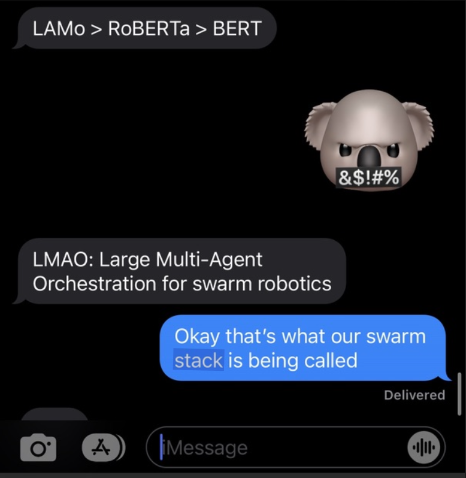

# LMAO: Large Multi-Agent Orchestration

<p align="center">
  
</p>

**[Click Here For The Demo Video](https://drive.google.com/file/d/1bso0aLG4nzO8LqolHW5HlTcH2Tp7uafm/view?usp=sharing)**

**Distributed autonomous exploration with onboard fault detection, isolation, and recovery.**

Planetary rovers today are slow, rigid, and fragile. A single rover follows a predetermined path, and when something goes wrong — a wheel gets stuck, a sensor fails, communications drop — the mission stalls while Earth-based operators diagnose and intervene. This model does not scale to missions that demand continuous resource acquisition for repair, fuel, or life support in dynamic, uncertain environments.

LMAO replaces the single-rover paradigm with a **hub-and-scout architecture**. A stationary hub deploys lightweight scout rovers that autonomously navigate to resource targets, adapt when conditions change, and recover from failures without human intervention. When a scout gets stuck, it detects the fault onboard and executes a physical recovery maneuver. When a sensor degrades, the system gracefully reduces capability rather than halting. When communications drop, scouts continue operating on their last-known mission parameters while the hub replans around them.

The central hub runs an AI mission planner (Claude API) that decomposes high-level objectives into robot tasks, monitors fleet health in real time, and dynamically reassigns work when scouts fail or conditions shift. This is the "O" in LMAO: the orchestration layer that makes multi-agent exploration resilient and scalable.

## Why distributed architecture

| Single rover | Hub + scouts |
|---|---|
| One failure stops the mission | Fleet continues with remaining scouts |
| Fixed path, no adaptation | Dynamic replanning around obstacles and failures |
| All sensors on one platform | Redundancy across multiple platforms |
| Human-in-the-loop for every fault | Onboard FDIR handles faults autonomously |
| Scales by building bigger rovers | Scales by deploying more scouts |

A hub-and-scout fleet distributes risk. Losing a scout degrades capability but never ends the mission. The hub redistributes that scout's tasks to healthy rovers and continues. This mirrors how NASA designs redundant spacecraft systems with no single point of failure.

## Onboard FDIR: why it matters

Fault Detection, Isolation, and Recovery is the critical capability that enables truly autonomous exploration. Mars rovers experience 4-24 minute communication delays with Earth. Curiosity and Perseverance have pre-programmed safe modes, but they still require human diagnosis for most faults. For future missions, such as lunar resource extraction, Mars sample caching, deep-space exploration, rovers must detect and recover from faults independently.

LMAO implements a multi-channel FDIR stack running onboard each scout:

**Detection channels:**
- **Topic rate health**: rolling-window monitoring of every ROS2 data stream. If LiDAR drops below 50% of expected rate, the system flags degradation before total failure.
- **Frozen feed detection**: frame-to-frame image differencing catches the subtle failure where a camera topic keeps publishing but the image never changes.
- **Joint command vs actual**: compares commanded arm positions to encoder readings. Catches stuck joints, collisions, and mechanical failures.
- **IMU/encoder cross-validation**: compares wheel odometry against IMU integration to detect wheel slip, terrain anomalies, and sensor drift.
- **LiDAR-camera cross-check**: projects LiDAR points into the camera frame and compares depth estimates. Detects sensor occlusion and calibration drift.

**Recovery behaviors:**
- **Physical self-recovery**: when a scout detects it's stuck (commanded motion but no odometry change), it autonomously executes a scoop/arm maneuver to push itself free, then verifies recovery and resumes the mission.
- **Graceful degradation**: five-tier capability model (FULL_CAPABILITY, DEGRADED_SENSORS, LOCAL_ONLY, SAFE_MODE, HIBERNATION) with automatic tier transitions. Each transition adjusts what the scout attempts rather than simply stopping.
- **Communications blackout protocol**: when a scout loses contact with the hub, it falls back to autonomous operation on its last-known mission parameters. The hub detects the loss and replans without that scout. When comms restore, the system reconciles state and redistributes work across the reunified fleet. This directly mirrors how Mars rovers handle Earth-contact windows.

**Fault injection framework**: a command-driven system that lets operators trigger specific faults (LiDAR occlusion, camera freeze, encoder drift, comms loss) on demand. This enables repeatable testing and live demonstration of the FDIR stack — the same approach NASA uses for mission software validation.

## System architecture

```
Human operator
    │ natural language commands
    ▼
Hub planner (base station laptop)
    ├── Claude API reasoner ←→ World model
    │   mission planning        map, resources, fleet state
    │   + replan
    ├── Task allocator          Fleet health monitor
    │   assign missions         degradation tiers, alerts
    │   to scouts
    └── Mission dashboard (React UI)
        live map, FDIR events, replan log
    │
    │ ROS2 / WebSocket
    ▼
Scout rovers (Innate MARS)
    ├── VLM perception (Orin Nano)
    ├── Local FDIR stack
    ├── Nav + manipulation
    └── Comms fallback mode
```

## Quick start

### 1. Robot setup (after battery connect / reboot)

```bash
ssh jetson1@mars-the-18th.local
# password: goodbot18

# Verify innate services are running (14 nodes in tmux)
innate service view
# Ctrl+B then d to detach
```

The robot's WebSocket server (`rws_server`) starts automatically on **port 9090**.
The orchestrator and dashboard both connect to this; no extra launch needed.

**If you need rosbridge** (e.g. for raw roslibpy scripts or third-party tools), launch
it inside the innate service tmux so it joins the Zenoh DDS mesh:

```bash
innate service view
# Ctrl+B then c  (new tmux window)
RMW_IMPLEMENTATION=rmw_zenoh_cpp ros2 launch rosbridge_server rosbridge_websocket_launch.xml port:=9091
```

> **Why inside tmux?** MARS uses Zenoh as its DDS layer. Nodes launched outside
> the innate service tmux can't discover the Zenoh router and won't see topic data.

### 2. Laptop (orchestrator)

```bash
# From repo root
cp .env.example .env          # add your ANTHROPIC_API_KEY
uv run python -m orchestrator          # real robot
uv run python -m orchestrator --sim    # simulated (no robot needed)
```

The orchestrator connects to `rws_server` on port 9090 (configured in
`orchestrator/fleet_config.yaml`), starts the health monitor, Claude
reasoner, and API server on port 8000.

### 3. Laptop (dashboard)

```bash
cd dashboard
pnpm install
pnpm dev
```

Open `http://localhost:5173`:
- **Agent pages**: live camera feeds, telemetry, drive controls, IMU, LiDAR (direct to robot via port 9090)
- **Mission page** (`/mission`): Claude command input, fleet health, task assignments, event stream (via orchestrator API on port 8000)

## Robot connection details

| Method | Command |
|--------|---------|
| WiFi | `ssh jetson1@mars-the-18th.local` |
| Ethernet | `ssh jetson1@192.168.50.2` (set laptop to 192.168.50.1/24) |
| USB-C | `ssh jetson1@192.168.55.1` |

Password: `goodbot18`
Robot IP (on Robot WiFi): `172.17.30.66`

| Port | Service | Used by |
|------|---------|---------|
| 9090 | rws_server (innate WebSocket) | Dashboard agent pages + orchestrator |
| 9091 | rosbridge (if launched) | Raw roslibpy scripts |
| 8000 | Orchestrator API | Dashboard mission page |
| 8765 | Foxglove bridge (if launched) | Foxglove Studio visualization |

## Repository structure

```
lmao/
├── orchestrator/                   ← hub planner (laptop-side)
│   ├── __main__.py                 ← entry point: python -m orchestrator
│   ├── fleet_config.yaml           ← robot IPs, health thresholds
│   ├── api.py                      ← FastAPI server for dashboard
│   ├── comms/connection_manager.py ← WebSocket to rws_server (skill framework)
│   ├── world_model/                ← fleet state, tasks, events, position history
│   ├── health/                     ← rate monitoring, degradation tiers, comms blackout
│   ├── reasoner/                   ← Claude API tool-use reasoning + replan
│   ├── allocator/                  ← task assignment scoring
│   ├── cli/repl.py                 ← operator CLI (also works alongside dashboard)
│   └── sim.py                      ← simulated robots for offline dev
│
├── lucas_dashboard/                ← React dashboard (Vite + TanStack Router)
│   └── src/routes/mission.tsx      ← orchestrator mission control page
│
├── ros2/lmao_fdir/                 ← on-robot FDIR (ROS2 package)
│   └── lmao_fdir/
│       ├── fdir_node.py            ← coordinator: aggregates all channels
│       ├── transport.py            ← dual ROS2/roslibpy transport abstraction
│       ├── laptop_runner.py        ← off-robot dev entry point
│       └── channels/               ← fault injection, rate health, frozen feed, joint check
│
├── skills/                         ← robot skills (hot-reloaded on deploy)
├── tests/                          ← platform validation tests
└── docs/
    ├── REFERENCE.md                ← MARS topics, rates, FDIR channel catalog
    └── REACT_UI_INTEGRATION.md     ← API surface for dashboard integration
```

## Deploy workflow

```bash
# On the robot, one time:
git clone https://github.com/787-10/LMAO.git ~/lmao
~/lmao/scripts/install_symlinks.sh

# Every deploy after that:
cd ~/lmao && git pull && innate build lmao_fdir
```

Skills are hot-reloaded by `brain_client` without rebuild. ROS2 package changes
need `innate build lmao_fdir`.

## Built with

- [Innate MARS](https://docs.innate.bot): robot platform (Jetson Orin Nano, ROS2 Humble, Zenoh DDS)
- [Claude API](https://docs.anthropic.com): mission planning and replanning via tool use
- [Qwen2.5-VL](https://github.com/QwenLM/Qwen2.5-VL): onboard vision-language model for visual perception
- React + TanStack Router + Tailwind: mission control dashboard

## References

- `docs/REFERENCE.md`: verified MARS topics, rates, FDIR channel catalog
- `docs/REACT_UI_INTEGRATION.md`: orchestrator API for dashboard
- `tests/README.md`: platform validation checklist
- Innate docs: https://docs.innate.bot
